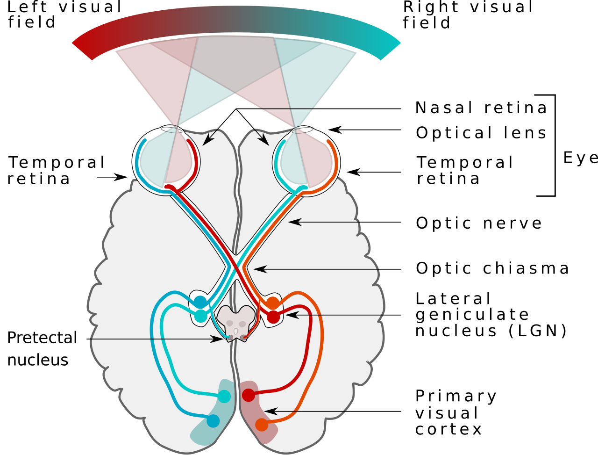
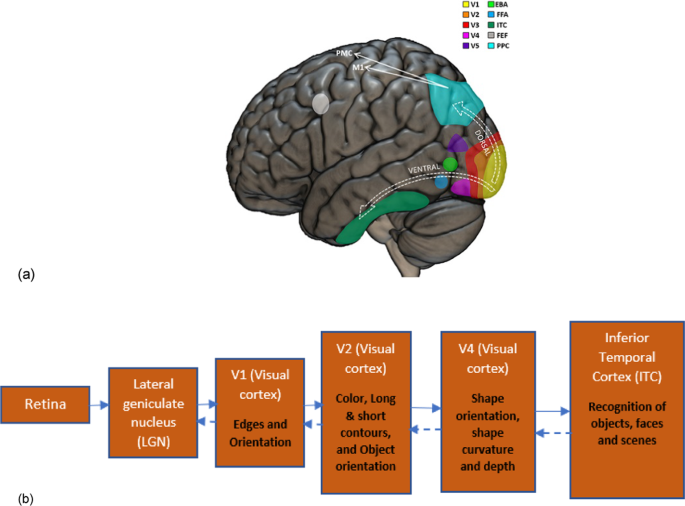

# bio-visual-cnn

**Bio-Inspired Visual Convolutional Neural Networks**  
*CNN architectures modeled on the hierarchical structure and computational principles of biological visual neural networks*

[](https://pytorch.org/)
[](https://opensource.org/licenses/MIT)
[](https://arxiv.org/abs/XXXX.XXXXX) <!-- 占位，论文出来后更新 -->

A research codebase exploring how insights from the primate visual pathway (retina → LGN → V1 → V2 → higher visual areas) can be translated into modern convolutional neural network designs. By incorporating biologically plausible inductive biases—such as orientation-selective receptive fields, hierarchical abstraction, and normalization mechanisms—we aim to improve robustness, interpretability, and biological alignment of vision models.

## Table of Contents
- [Overview](#overview)
- [Installation](#installation)
- [Quick Start](#quick-start)
- [Biological Background](#biological-background)
- [Architecture](#architecture)
- [Key Features & Advantages](#key-features--advantages)
- [Usage & Configuration](#usage--configuration)
- [Experiments & Results](#experiments--results) <!-- 占位 -->
- [Related Work](#related-work)
- [Citation](#citation)
- [Contributing](#contributing)
- [License](#license)

## Overview

Standard deep CNNs were originally inspired by the seminal work of Hubel & Wiesel on visual cortex simple and complex cells. However, modern architectures have largely diverged from biological constraints. This project systematically re-introduces key computational principles from biological visual processing into CNN design, creating models that are not only high-performing but also more robust and interpretable.

The repository supports modular construction of bio-inspired stages (especially V1-like front-ends) that can be plugged into ResNet, ConvNeXt, or custom backbones.

## Installation

```bash
git clone https://github.com/<your-username>/bio-visual-cnn.git
cd bio-visual-cnn
pip install -e ".[dev]"
```

Quick Start

```python
import torch
from bio_visual_cnn import BioVisualCNN

# Create a model with V1-inspired front-end
model = BioVisualCNN(
    num_classes=1000,
    v1_like=True,           # Enable orientation-selective front-end
    num_orientations=8,
    use_divisive_norm=True
)

x = torch.randn(1, 3, 224, 224)
out = model(x)
print(out.shape)  # torch.Size([1, 1000])
```

## Biological Background
The primate visual system processes information through a highly structured hierarchy:

Retina: Center-surround receptive fields, local contrast enhancement, and adaptation.
LGN (Lateral Geniculate Nucleus): Relay station with strong divisive normalization and contrast gain control.
V1 (Primary Visual Cortex): Simple cells with oriented, bandpass receptive fields (approximately Gabor-like); complex cells providing phase invariance through spatial pooling.
V2 and higher areas: Contour integration, texture and figure-ground processing, increasing invariance to position, scale, and viewpoint, ultimately supporting object recognition in inferotemporal cortex (IT).

These stages progressively build more abstract and invariant representations while maintaining local computations and sparse, efficient coding. Many of these principles were foundational to early connectionist vision models (Neocognitron, original CNNs), yet contemporary deep networks often lose explicit orientation tuning, normalization, and hierarchical inductive biases.



Visual system - Wikipedia

图1：灵长类视觉系统整体通路（视网膜 → LGN → 视觉皮层各区域）


Neuroscientific insights about computer vision models: a concise review |  Biological Cybernetics | Springer Nature Link

图2：视觉皮层层级功能分工（Retina → LGN → V1 边缘/朝向 → V2 轮廓 → V4 形状 → ITC 物体识别）。非常适合放在 Architecture 部分，用来展示“生物结构 → CNN 映射”。


## Architecture
Our design follows a modular, biologically-grounded hierarchy while remaining compatible with modern deep learning practices.
1. Early Visual Front-end (Retina + LGN + V1 inspired)

Optional fixed or learnable bank of multi-scale, multi-orientation filters (Gabor-like or data-driven approximations).
Separate pathways for simple-cell-like (linear filtering + rectification) and complex-cell-like (max-pooling or energy model) responses.
Divisive normalization layers modeling LGN/V1 contrast gain control.
This stage dramatically increases shape bias and reduces texture bias compared to standard convolutions.

2. Mid-to-High Visual Hierarchy (V2+ inspired)

Stacked convolutional stages with progressively larger receptive fields.
Optional addition of contour-integration or grouping mechanisms (inspired by V2 long-range horizontal connections).
Skip connections or feedback-like pathways to mimic cortico-cortical communication (optional, for research experiments).
Global average pooling + classification head, or more biologically plausible readout mechanisms.

3. Implementation Highlights

Configurable biological fidelity: You can dial the strength of V1-like constraints from “lightly inspired” (learnable conv + extra normalization) to “strongly constrained” (fixed Gabor front-end + explicit simple/complex cell separation).
PyTorch-native: All components are differentiable and work seamlessly with torchvision models, timm, or custom training loops.
Extensibility: Easy to add new bio-inspired modules (e.g., spiking front-end, predictive coding, or attention mechanisms aligned with visual cortex).

Example layer mapping (conceptual):
Biological StageCNN ComponentKey PropertyRetina / LGNInitial conv + normalizationLocal contrast, gain controlV1 Simple cellsOriented filter bankOrientation & spatial frequency selectivityV1 Complex cellsMax-pooling / energy poolingPhase invarianceV2+Deeper conv stages + groupingContour integration, abstractionIT readoutClassifier / linear readoutInvariant object recognition

## Key Features & Advantages

Improved robustness: Better performance under adversarial attacks, common corruptions, and out-of-distribution shifts (shape bias ↑).
Biological alignment: Higher predictivity of neural responses in macaque V1/V2 when evaluated with brain-score style metrics.
Interpretability: Explicit orientation maps, easier visualization of what each stage computes.
Research-friendly: Highly configurable; ideal for ablation studies on which biological ingredients matter most.
Hardware implications: The structured front-end is more amenable to neuromorphic or analog implementations.

## Trade-offs & Nuances:

Strong biological constraints can slightly reduce peak ImageNet accuracy unless compensated by scale or better optimization.
Fixed Gabor front-ends reduce learnable parameters in early layers but may require careful scaling of subsequent stages.
Not every biological detail is beneficial—some stochasticity or noise in cortex may be detrimental when directly copied into deterministic networks.

## Usage & Configuration
See configs/ folder and examples/ for detailed YAML configs and training scripts.
Key hyperparameters:

v1_like: Enable/disable V1 front-end
num_orientations, gabor_scales
divisive_norm: Strength of normalization
freeze_v1: Whether to keep early filters fixed (biologically more faithful)

## Experiments & Results

Robustness benchmarks (ImageNet-C, ImageNet-A, adversarial)
Brain-predictivity scores
Ablation studies on biological components
Comparison with VOneNet, CORnet, standard ResNet baselines

## Related Work

VOneNet family (DiCarlo Lab) — V1 front-end for robustness
CORnet models — shallow recurrent networks aligned with visual cortex
Classical work on Neocognitron, HMAX, and VisNet
Modern efforts on shape bias, adversarial robustness via biological priors

## Citation
If you use this codebase or models in your research, please cite:

```bibtex
@article{YourName2026BioVisualCNN,
  title={BioVisualCNN: CNNs with Biologically-Inspired Visual Hierarchy},
  author={Your Name and Collaborators},
  journal={arXiv preprint arXiv:XXXX.XXXXX},
  year={2026}
}
```

## Contributing
We welcome contributions on new bio-inspired modules, better alignment metrics, or applications to other modalities. Please open an issue or pull request.